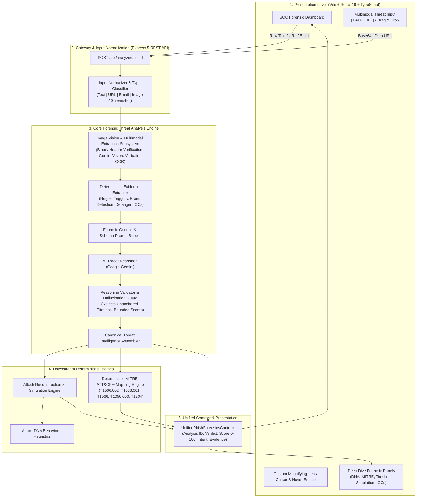
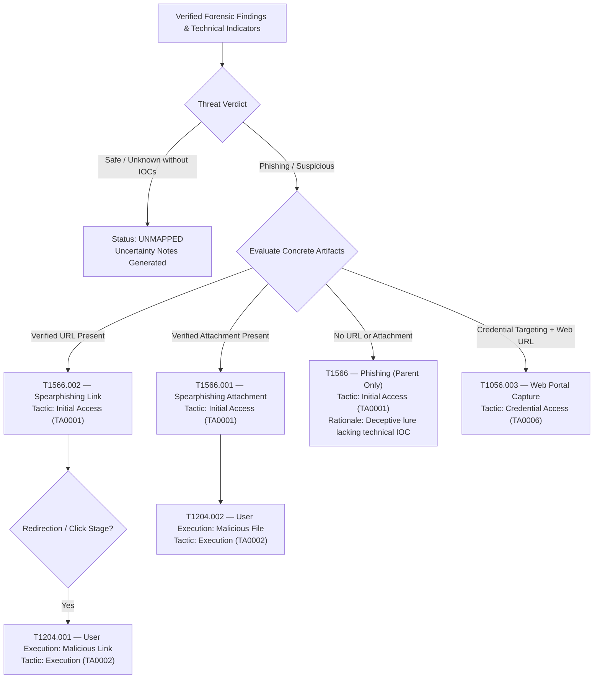

# PhishForensics AI 🛡️🔍

> **"Don't just detect the phishing. Reconstruct the attack."**

[](https://opensource.org/licenses/MIT)
[](https://www.typescriptlang.org/)
[](https://react.dev/)
[](https://nodejs.org/)
[](https://ai.google.dev/)
[](https://attack.mitre.org/)
[](#forensic-safety-boundary)

---

## 📌 Executive Summary

**PhishForensics AI** is an explainable cybersecurity forensic investigation and adversary reconstruction platform. Traditional security tools stop at binary labels (*"Phishing"* or *"Safe"*) with opaque risk scores. PhishForensics AI inverts this paradigm by treating every suspicious artifact—whether raw email, malicious URL, body text, or uploaded screenshot—as digital evidence to be **dissected, verified, and reconstructed**.

The platform extracts observable forensic indicators, maps them against **MITRE ATT&CK® Enterprise TTPs**, generates behavioral **Attack DNA fingerprints**, dynamically models the attacker's multi-stage kill chain, and allows security teams and end users to safely walk through an educational attack simulation in a zero-risk sandbox.

---

## 🏗️ System Architecture

PhishForensics AI follows a strictly decoupled, **Evidence-First Architecture** where LLM reasoning is anchored to deterministic evidence catalogs, enforced by hallucination guards, and validated through a shared canonical contract.

### High-Level System Architecture Diagram



---

## 👁️ Multimodal Image & Vision Analysis Pipeline

PhishForensics AI features an end-to-end multimodal pipeline capable of analyzing screenshots of phishing emails, spoofed login portals, and security alerts without relying on client-side text input.

```mermaid
sequenceDiagram
    autonumber
    actor User as Security Analyst / User
    participant Frontend as Frontend Dashboard
    participant API as /api/analyze/unified
    participant Analyzer as Image Analyzer Subsystem
    participant Gemini as Google Gemini Multimodal Vision
    participant Extractor as Deterministic Evidence Extractor
    participant Validator as Reasoning Validator
    participant MITRE as MITRE ATT&CK Engine

    User->>Frontend: Uploads PNG/JPG screenshot
    Frontend->>API: POST { type: "image", content: "data:image/png;base64,..." }
    API->>Analyzer: parseImagePayload() & validateImageMagicBytes()
    alt Corrupted Image Binary (Case B Fallback)
        Analyzer-->>API: Processing Failure (Corrupted Magic Bytes)
        API-->>Frontend: Return Structured Fallback: verdict="unknown", riskScore=null, confidence=15%
    else Valid Image Binary
        Analyzer->>Gemini: Multimodal Extraction (inlineData + Forensic Vision Prompt)
        Gemini-->>Analyzer: Structured JSON (visibleText, extractedUrls, suspiciousPhrases, visualCues)
        Analyzer->>Extractor: Populate visible text & extracted URLs into artifact
        Extractor->>Extractor: Extract urgency triggers, defanged IOCs (EV-001, IOC-001)
        Extractor->>Gemini: Deep Threat Reasoning (Multimodal Image + Evidence Catalog)
        Gemini-->>Validator: Raw Reasoning Output (Verdict, Score, Cited Evidence IDs)
        Validator->>Validator: Validate citations against Catalog (Hallucination Guard)
        Validator->>MITRE: Pass canonical findings & verified URLs
        MITRE-->>Frontend: Unified Response (Risk Score XX/100, Defanged Evidence, MITRE T1566.002)
    end
```

### Multimodal Pipeline Stages:
1. **Magic Byte Verification**: Verifies binary headers (PNG `89 50 4E 47`, JPEG `FF D8 FF`, WEBP `RIFF....WEBP`, GIF, BMP) before model dispatch.
2. **Passive Vision Extraction**: Extracts verbatim visible text, hyperlinks, contact phone numbers, sender addresses, authority impersonation cues, and graphic indicators (fake alert banners, countdown clocks, credential capture forms).
3. **Deterministic Evidence Cataloging**: Converts observed items into immutable evidence records (`EV-001`, `EV-002`, `IOC-001`) with automatic defanging (`hxxps://`, `[@]`, `[.]`).
4. **Multimodal Dual-Context Reasoning**: Dispatches the prompt **and** binary image data (`inlineData: { mimeType, data }`) to the reasoning model, allowing visual styling verification without character limit truncation.
5. **Fail-Safe Fallback Separation**:
   - **Case A (Benign/Inconclusive)**: Clear image with no threat signals $\rightarrow$ `verdict: safe`, `riskScore: 0-10`, `confidence: 95%`.
   - **Case B (Decoding Failure)**: Corrupted image or network failure $\rightarrow$ `verdict: unknown`, `riskScore: null`, `confidence: 15%`, explicit error rationale.

---

## 🎯 Deterministic MITRE ATT&CK® Enterprise Mapping

Unlike generative approaches where language models invent fictional technique IDs, PhishForensics AI maps threats **strictly through a deterministic rule-based evaluation matrix**.



| Technique ID | Technique Name | Tactic | Strict Trigger Requirement |
| :--- | :--- | :--- | :--- |
| **T1566.002** | Spearphishing Link | Initial Access (`TA0001`) | Verified technical URL/domain extracted from email, text, or screenshot. |
| **T1566.001** | Spearphishing Attachment | Initial Access (`TA0001`) | Concrete file attachment indicator (`.pdf`, `.exe`, `.zip`, `.docx`). |
| **T1566** | Phishing (Parent) | Initial Access (`TA0001`) | Social engineering lure detected without concrete URL or file indicator. |
| **T1056.003** | Web Portal Capture | Credential Access (`TA0006`) | Credential harvesting intent combined with verified web portal link. |
| **T1204.001** | User Execution: Malicious Link | Execution (`TA0002`) | Attack timeline identifies recipient link click as prerequisite. |
| **T1204.002** | User Execution: Malicious File | Execution (`TA0002`) | Attack timeline identifies victim file opening/execution step. |

---

## 🧬 Key Features

### 1. Simple by Default, Deep When Requested (UX Model)
The investigation interface presents a high-level SOC summary at first glance:
- **Investigation Top Bar**: Analysis ID, source type badge, and timestamp.
- **Threat Verdict Card**: Prominent status hero (`PHISHING`, `SUSPICIOUS`, `SAFE`, `UNKNOWN`).
- **Quantitative Metrics**: Dynamic **0–100 Numeric Risk Score** with color-coded meter, plus an evidence-grounded **Confidence Score (%)**.
- **Plain-English Executive Explanation**: Context-aware summary explaining *why* the content is dangerous.
- **Deep-Dive Forensic Tabs**: Interactive drawers for Attack DNA, Reconstruction, MITRE Mapping, Defanged IOCs, and Educational Simulations.

### 2. Behavioral Attack DNA
Analyzes the psychological and tactical anatomy of the attack across key dimensions:
- Authority Impersonation
- Artificial Urgency & Coercion
- Credential Harvesting Trajectory
- Technical Masquerading & Lookalike Domains
- Fear & Consequence Pressure

### 3. Attack Flow Reconstruction Timeline
Deconstructs the attack into an interactive chronological sequence:
1. **Pretext Delivery**: Delivery of deceptive communication.
2. **Lure & Coercion**: Inducing emotional urgency.
3. **Redirection / Gateway**: Transit through phishing links.
4. **Credential Harvesting / Payload**: Simulated consequence without executing code.

### 4. Interactive Safe Educational Simulation
An interactive educational walkthrough allowing users to safely inspect deceptive visual triggers (counterfeit logos, lookalike domains, urgent warnings) without interacting with live infrastructure.

### 5. Custom Cybersecurity Magnifying-Lens Cursor
A dedicated custom inspection cursor with an integrated `+` zoom reticle and micro-magnification on hover, tailored for digital forensic analysts inspecting minute interface cues.

---

## 🔒 Forensic Safety Boundary

PhishForensics AI enforces strict, non-negotiable safety principles:

```
[ UNTRUSTED INPUT ] ---> [ PASSIVE PARSING ] ---> [ DEFANGING ] ---> [ NO EGRESS ]
                                                        │
                      ┌─────────────────────────────────┴─────────────────────────────────┐
                      ▼                                                                   ▼
       "http://phish-site.com/login"                                          "victim@domain.com"
                      │                                                                   │
                      ▼                                                                   ▼
       "hxxp://phish-site[.]com/login"                                        "victim[@]domain[.]com"
```

- **Zero Active Interaction**: The system **never** performs HTTP GET/POST requests, DNS lookups, or port scans against extracted URLs or domains.
- **Automatic Defanging**: All indicators in results and API payloads are defanged (`http://` $\rightarrow$ `hxxp://`, `https://` $\rightarrow$ `hxxps://`, `.` $\rightarrow$ `[.]`, `@` $\rightarrow$ `[@]`).
- **No Malicious Payload Execution**: Attachments and scripts are treated purely as passive data strings/byte arrays.

---

## 📁 Repository Structure

```
phishforensics-ai/
├── backend/
│   ├── src/
│   │   ├── controllers/
│   │   │   └── analyzeController.js        # REST endpoints and request validation
│   │   ├── routes/
│   │   │   └── analyze.js                  # /api/analyze routes
│   │   ├── services/
│   │   │   ├── aiEngine.js                 # AI integration boundary
│   │   │   ├── analyzeService.js           # Pipeline orchestrator
│   │   │   ├── simulationOrchestrator.ts   # Reconstruction & DNA engine bridge
│   │   │   ├── unifiedAdapter.ts           # Canonical-to-Unified contract mapper
│   │   │   ├── ai-threat-analysis/         # AI Threat Intelligence Subsystem
│   │   │   │   ├── config.ts               # Environment validation & limits
│   │   │   │   ├── evidenceExtractor.ts    # Deterministic evidence cataloger
│   │   │   │   ├── geminiProvider.ts       # Multimodal Gemini API client
│   │   │   │   ├── imageAnalyzer.ts        # Vision, OCR & binary validation
│   │   │   │   ├── normalizer.ts           # Artifact sanitization & hashing
│   │   │   │   ├── promptBuilder.ts        # Prompt constructor
│   │   │   │   ├── reasoningValidator.ts   # Hallucination guard & citation verifier
│   │   │   │   ├── resultAssembler.ts      # Canonical result builder
│   │   │   │   ├── safety.ts               # Defanging and passive guards
│   │   │   │   └── threatAnalysisPipeline.ts # Main analysis pipeline coordinator
│   │   │   └── mitre/                      # Deterministic MITRE ATT&CK Engine
│   │   │       ├── catalog.ts              # Verified MITRE technique definitions
│   │   │       ├── mitreMapper.ts          # Main mapping coordinator
│   │   │       └── rules.ts                # Deterministic rule evaluator
│   │   ├── utils/
│   │   │   ├── AppError.js                 # Centralized error model
│   │   │   └── inputNormalizer.js          # Ingestion sanitization
│   │   └── server.js                       # Express app bootstrap
│   ├── tests/
│   │   ├── fixtures/                       # Test images and screenshots
│   │   ├── test_mitre_mapping.ts           # MITRE evaluation test suite (5/5)
│   │   ├── test_image_scenarios.ts         # Multimodal scenario test suite (A, B, C, D)
│   │   └── test_simulation_orchestrator.ts # Reconstruction engine tests
│   └── package.json
├── frontend/
│   ├── src/
│   │   ├── components/                     # Reusable forensic UI widgets
│   │   ├── layouts/
│   │   │   └── MainLayout.tsx              # Top navigation & custom cursor
│   │   ├── pages/
│   │   │   ├── Home.tsx                    # Ingestion portal (+ ADD FILE / Text)
│   │   │   ├── Dashboard.tsx               # Primary SOC Investigation Dashboard
│   │   │   ├── Dashboard.css               # SOC dashboard styling
│   │   │   └── Home.css
│   │   ├── services/
│   │   │   └── api.ts                      # Backend API client
│   │   ├── types/                          # Frontend interfaces
│   │   ├── App.tsx                         # Router configuration
│   │   └── index.css                       # Design system & theme tokens
│   └── package.json
└── shared/
    ├── types/
    │   ├── threat-intelligence.ts          # CanonicalThreatIntelligence model
    │   ├── unified-contract.ts             # UnifiedPhishForensicsContract model
    │   ├── mitre.ts                        # MITRE ATT&CK schema
    │   ├── attack-dna.ts                   # Attack DNA schema
    │   └── reconstruction.ts               # Attack reconstruction schema
    └── validateUnifiedContract.js          # Runtime contract validator
```

---

## 🚀 Quick Start Guide

### Prerequisites
- **Node.js**: v20.0.0 or higher
- **npm**: v10.0.0 or higher
- **Google Gemini API Key**: [Get an API Key here](https://aistudio.google.com/)

---

### 1. Installation

Clone the repository and install dependencies:

```bash
# Clone the repository
git clone https://github.com/kunkuabhinash-hub/phishforensics-ai.git
cd phishforensics-ai

# Install backend dependencies
cd backend
npm install

# Install frontend dependencies
cd ../frontend
npm install
```

---

### 2. Environment Configuration

Create a `.env` file in the `backend/` directory:

```env
PORT=3000
AI_PROVIDER=gemini
AI_MODEL=gemini-3.5-flash-lite
GEMINI_API_KEY=your_gemini_api_key_here
AI_TIMEOUT_MS=30000
AI_MAX_INPUT_CHARS=100000
```

---

### 3. Running the Development Servers

#### Start Backend Dev Server:
```bash
cd backend
npm run dev
# Server runs on http://localhost:3000
```

#### Start Frontend Dev Server:
```bash
cd frontend
npm run dev
# Application runs on http://localhost:5173
```

Navigate to `http://localhost:5173` to start investigating threats.

---

### 4. Running Automated Tests

PhishForensics AI includes automated test suites covering the entire analysis pipeline:

```bash
cd backend

# Run Deterministic MITRE ATT&CK Mapping Tests
npx tsx tests/test_mitre_mapping.ts

# Run Multimodal Image Pipeline Scenario Tests (Phishing, Benign, Blank, Corrupted)
npx tsx tests/test_image_scenarios.ts

# Run Simulation & Reconstruction Pipeline Tests
npx tsx tests/test_simulation_orchestrator.ts
```

#### Validate Frontend Build:
```bash
cd frontend
npm run build
```

---

## 📡 API Reference

### Unified Threat Analysis Endpoint

#### `POST /api/analyze/unified`

Analyzes suspicious text, email, URL, or image content and returns a complete forensic investigation report.

**Headers:**
```
Content-Type: application/json
```

**Request Body (Text / Email / URL):**
```json
{
  "type": "text",
  "content": "SECURITY ALERT: Your account has been suspended. Verify immediately at: https://secure-login.bank-update.com/verify within 24 hours.",
  "source": "email_client"
}
```

**Request Body (Image / Screenshot):**
```json
{
  "type": "image",
  "content": "data:image/png;base64,iVBORw0KGgoAAAANSUhEUg...",
  "source": "user_upload"
}
```

**Sample Unified Response:**
```json
{
  "analysisId": "4a9a08e1-5120-410a-b52b-42eb3a8a3a0e",
  "timestamp": "2026-09-26T04:15:00.000Z",
  "input": {
    "sourceType": "image",
    "content": "data:image/png;base64,..."
  },
  "threatAssessment": {
    "verdict": "phishing",
    "severity": "high",
    "riskScore": 90,
    "confidence": 95,
    "justification": "The artifact exhibits a fake security alert banner, urgent verification demands, a 24-hour deadline, and a suspicious link to an unverified domain."
  },
  "attackerIntent": {
    "primaryGoal": "Credential harvesting via a deceptive login page",
    "description": "Clicking the malicious URL and entering banking credentials",
    "potentialImpact": "Account takeover, unauthorized financial transactions"
  },
  "evidence": [
    {
      "id": "IOC-001",
      "category": "technical",
      "value": "https://secure-login.bank-update.com/verify",
      "defangedValue": "hxxps://secure-login[.]bank-update[.]com/verify",
      "description": "URL extracted from artifact",
      "confidence": 95
    },
    {
      "id": "EV-001",
      "category": "contextual",
      "value": "24 hours",
      "defangedValue": "24 hours",
      "description": "Observed textual indicator matching: \"24 hours\"",
      "confidence": 85
    }
  ],
  "mitreAttack": {
    "status": "mapped",
    "primaryTechnique": {
      "techniqueId": "T1566",
      "techniqueName": "Phishing",
      "subTechniqueId": "T1566.002",
      "subTechniqueName": "Spearphishing Link",
      "tactic": {
        "id": "TA0001",
        "name": "Initial Access"
      }
    },
    "techniques": [ ... ],
    "uncertaintyNotes": []
  }
}
```

---

## 👥 Contributors

PhishForensics AI was developed by:
- **Kunku Abhinash** & Team

---

## 📄 License

This project is licensed under the **MIT License** — see the [LICENSE](LICENSE) file for details.
